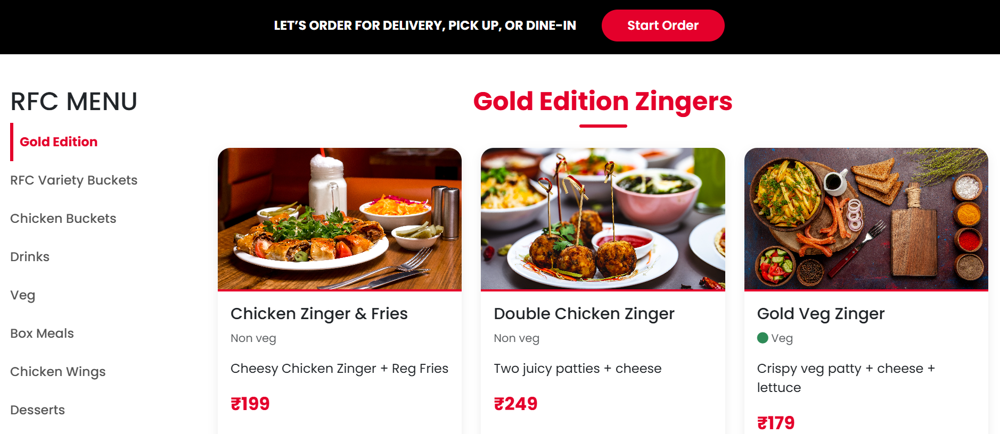

# 🍽️ Restaurant Website

A simple and responsive Restaurant Website built using HTML, CSS, and JavaScript. This project presents a clean and modern UI for showcasing restaurant details like menu, services, and contact information.

---

## 🚀 Features

- 🏠 Attractive Home Page
- 📖 Menu Section to display food items
- ℹ️ About Us section
- 📞 Contact Information section
- 📱 Fully Responsive Design (Mobile & Desktop)

---

## 🛠️ Technologies Used

- HTML5  
- CSS3  
- JavaScript  

---

## 📂 Project Structure

Resturant/
│── index.html
│── style.css
│── script.js
│── images/


---

## ▶️ How to Run the Project

1. Clone the repository:
   ```bash
   git clone https://github.com/Prasadkumbha/Restaurant-website.git

Navigate to the project folder:

cd Restaurant-website/Resturant
Open index.html in your browser
🎯 Purpose of the Project

This project was developed to practice and improve frontend development skills, including:

UI/UX Design
Responsive Web Design
Basic JavaScript functionality


## 📸 Screenshots

### 🏠 Home Page


### 📖 Menu Page


📌 Future Enhancements
Add backend integration (Spring Boot)
Implement online food ordering system
Add user authentication (Login/Register)
Connect to database (MySQL)


🙋‍♂️ Author
Prasad Kumbha

GitHub: https://github.com/Prasadkumbha
